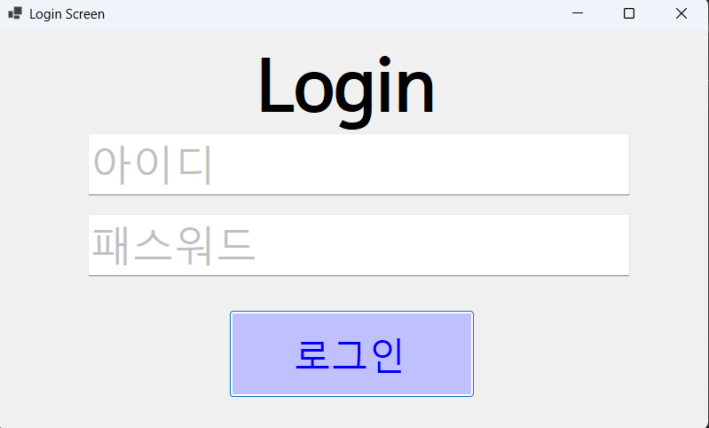
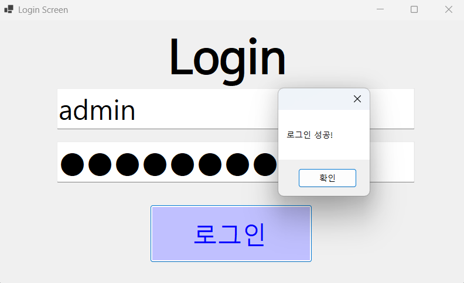
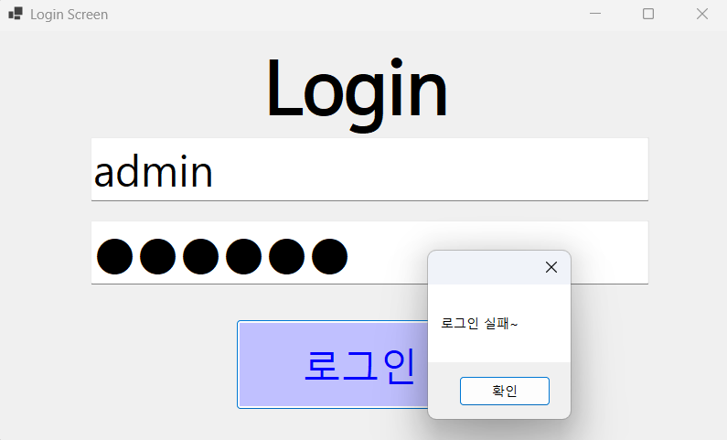
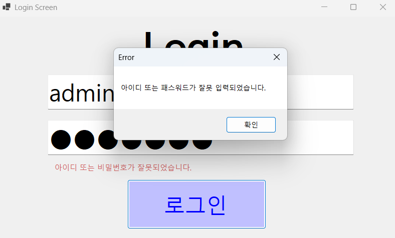
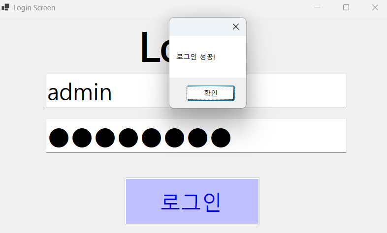

# (C# 코딩) 로그인 화면
## 개요
- C# 프로그래밍 학습
- 1줄 소개: 웹사이트에서 사용하고 로그인 화면 구현
- 사용한 플랫폼: 
- C#, .NET Windows Forms, Visual Studio, GitHub
- 사용한 컨트롤:
- Label, TextBox,Messagebox, Button
- 사용한 기술과 구현한 기능:
- Visual Studio를 이용하여 UI 디자인
- 비교,논리 연산자와 조건문을 사용하여 아이디와 페스워드의 일치 확인
- 메세지박스를 이용한 피드백 시스템 알림
- visible 속성을 활용해 힌트 메세지 활용

## 실행 화면 (과제1)
- 과제1 코드의 실행 스크린샷

- 과제 내용
- 로그인 화면의 기본적인 틀과 탭 순서 구현, 알맞은 아이디,패스워드 입력 시 나타내는 메세지 문구와 실패 문구,
- 초기 화면에서 아이디, 패스워드를 간단하게 나타내는 회색 글씨 박스를 클릭하면 글자가 사라지고 아이디와 패스워드를 칠수 있게 바뀌게 만듬
- 패스워드를 칠 때 타인이 보지 못하도록 암호화되게 나옴
- 구현 내용과 기능 설명
- textbox와 label,button으로 로그인 화면을 구현
- 아이디와 패스워드를 창에 회색 글씨로 아이디,패스워드를 나타내어 표시
- 탭 순서를 바꾸어 편의성 추구
- 패스워드를 타인이 보지 못하게 가리게 구현
- 알맞은 아이디와 패스워드를 치면 로그인 성공이란 문구가 뜨고 틀린 아이디와 암호를 치면 로그인 실패한 메세지문구가 나온다 

## 실행 화면 (과제2)
- 과제2 코드의 실행 스크린샷

- 과제 내용
- 로그인 실패 시 출력되는 메세지 창 변경
- 로그인 실패 시 화면 아래 작게 나타나는 실패 문구, 평상시(invisible)모드라 보이지 않음
- 구현 내용과 기능 설명
- 로그인 실패 시 출력되는 로그인 실패 창을 오류메세지 창으로 변경되게 만듬
- 평상시에는 보이지 않는 로그인 실패 문구가 로그인 실패 시 보이게 출력되고 다시 아이디와 비밀번호를 알맞게 입력하면 사라짐
## 실행 화면 (과제3)
- 과제3 코드의 실행 스크린샷

- 과제 내용
-
- 구현 내용과 기능 설명
- 
## 실행 화면 (과제4)
- 과제4 코드의 실행 스크린샷

- 과제 내용
-
- 구현 내용과 기능 설명
- 